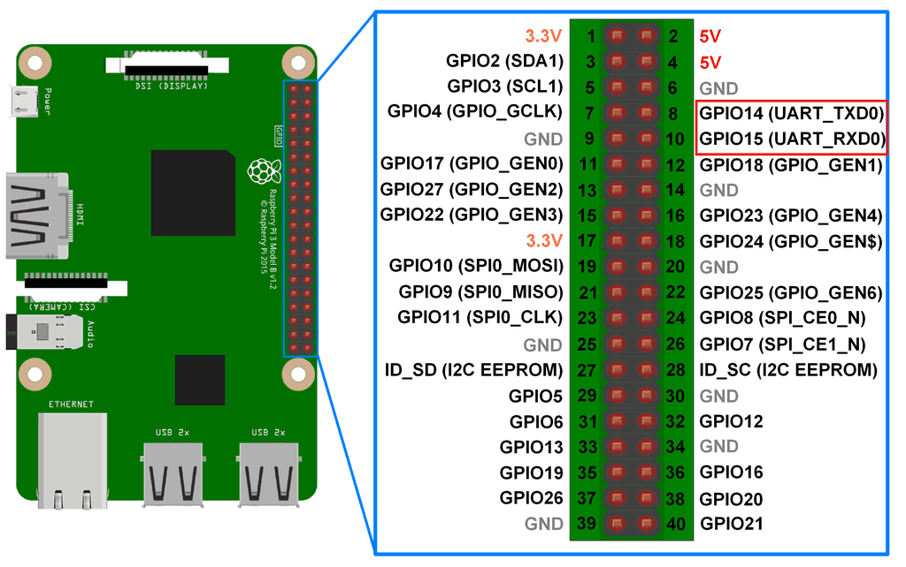

# Connecting Ajax UART bridge to Raspberry Pi

[Uart bridge](https://support.ajax.systems/en/manuals/uartbridge/)
[Documentation](https://support.ajax.systems/en/manuals/uartbridge/)

## Hardware linking
Easiest might be to use uart port #0 but it will require some reconfiguration of the gpio pins (instructions below). RPi 4 has 4 uart ports that can be used (3 alternatives at least).

There are 4 pins for serial/uart port #0 that are near by and are convenient to use (pins: 4,6,8,10).


Rx on RPi must be connected to Tx on Ajax UART board. And Tx on RPi connect to Rx pin on UART board.

## Raspberry Pi configuration
Before using serial0, we need to enable it in RPi configuration and disable other devices that might be willing to use it (console and bluetooth module).

Easiest way to perform that configuation is to use `raspi-config` utility on RPi. Here is [good manual in official documentation](https://www.raspberrypi.com/documentation/computers/configuration.html#disabling-the-linux-serial-console).

If successfull `sudo ls /dev |grep serial` should list `serial0` among few others.

On RPi 3 and above UART port is best to be used via `/dev/serial0` link. In prior versions it was recommeded to link to `/dev/ttyAMA0`.

Another [good source](https://raspberrypi.stackexchange.com/questions/45570/how-do-i-make-serial-work-on-the-raspberry-pi3-pizerow-pi4-or-later-models/45571#45571) on troubleshooting the issues.

## Testing UART link health
Simplest tool to check serial communicaiton via UART port is `minicom`.

You might need to `sudo apt-get install minicom`

Running minicom: `minicom -b 57600 -D /dev/serial0`

Normally you'll start seeing some messages coming from UART board right away. If for some reason you see unparsable giberish you can try `Ctrl-a, f` - this will send brake command into serial port and poetntially reset the protocol.

Under normal conditions you should start seeing something like this
```
RSTATE;30D849;FRS=0;
RSTATE;30D849;NSL=-90;NSL=-87;NSL=-91;NSL=-88;ONL=1;FUL=1;LLS=-71;FNM=0;DPT=5;PRT=0;
SYNC;943C26;0;
```

BTW: minicom didn't accept Ctrl-A command when I tried using it through VSCode terminal. But worked fine via OS terminal.

You can use minicom to enter service mode `stop` and add devices `add`. Official manual provides detailed description of this flow.
